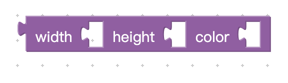
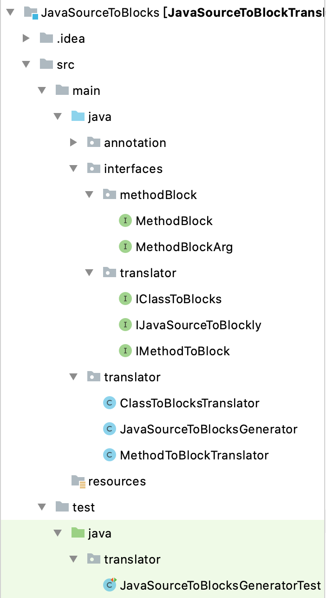

# Java Source To Blockly Subproject

>项目说明
>
>2020-11-10

[TOC]


## 项目目标

给定一个java的源代码文件（目前只支持Class定义文件），该项目将会将源文件中的定义的Class转换成一系列Blockly的Block Definition JS文件，转换方式在后文中详细说明。

例如，给定一个java文件 （java.lang.String.java)，转换成一个JSON文件（target/java.lang.String.JSON)


## 前提知识

### 自定义Block时候的配置项



在定义一个类似上述的Block的时候，Typically JSON配置文件如下

```javascript
{
  "type": "affine",
  "message0": "Affine %1 input_data_size %2 output_data_size %3",
  "args0": [
    {
      "type": "input_dummy",
      "align": "CENTRE"
    },
    {
      "type": "input_value",
      "name": "input_size",
      "check": "Array"
    },
    {
      "type": "input_value",
      "name": "output_size",
      "check": "Array"
    }
  ],
  "previousStatement": null,
  "nextStatement": null,
  "colour": 210,
  "inputsInline": true,
  "tooltip": "",
  "helpUrl": ""
}
```

Type: Block的类型，我们用来唯一标识Block的方式，类似于ID

Message0: Block的用户界面提示信息

Args0: Block的参数列表，其中每一项

​	type: input的类型，input_dummy表示什么都没有， input_value表示有input

​	name:参数的名称，类似于函数参数申明时候的参数名称

​	check: 后面跟的是参数的类型

previousStatement：Block如果是一个Statement Block，那么这一项可以接受一个前后Statement连接

nextStatement：Block如果是一个Statement Block，那么这一项可以接受一个前后Statement连接

colour： Block的颜色

inputsInline： Block的input的样式

tooltip： Block的使用说明

helpUrl： Block对应的Document的URL

具体信息请参考 **https://developers.google.com/blockly/guides/create-custom-blocks/define-blocks#inputs_and_fields_in_json**


### Java Class和Block的映射关系

在Java中，一个简单的Class Definition可能包含以下的部分

* Class Definition
  * Static Methods
  * Static Fields
  * Constructor
* Class Instance
  * Member Functions
  * Private Fields
  * Public Fields

我们的通过设计，进行了如下对应

####（一）实现Java Method和Blockly Block的一一对应

首先，我们将Method（Java）和Block（Blockly）作了一一映射。

在Java中，一个Method由以下三部分组成。

1. 方法签名 (signature) （包括方法的名称和方法的参数类型列表）
2. 返回类型 （方法返回的参数类型）
3. 方法主体 （方法的主代码块）

在Blockly中，一个Block由以下的部分组成

1. Block Type （Block的类型）
2. Block Message （描述Block的功能，也可以看作Block的Name）
3. args （Block在建立的时候所需要的参数，包含参数类型和参数名称）
4. Output（Block输出的类型）
5. 其他辅助功能（Tips/ manual）


因此， Java的Method和Blockly的Block有天然的对应关系。我们将使用以下的对应关系。

| Java                 | Blockly           |
| -------------------- | ----------------- |
| Method Name          | Block Message     |
| Method Return Type   | Block Output Type |
| Method Argument List | Block args        |
| Method Body          | 新增Code Body     |

在实现上，我们通过实现了Java Annotaion Blockly对Java的Method进行标注。Annotation如下

```java
public @interface Blockly {
    String returnType() default "";
    String methodName() default "";
    String methodBody() default "";
    String[] argType();
}
```

对应的Method标注例子如下

```java
@Blockly(returnType = "Integer", methodName = "calcArea@I_String", argType = {"Integer", "String"})
public int calcArea(int deprecatedI, String deprecatedS){
  return this.width * this.height;
}
```

之后，再通过Java Annotaion提供的反射机制和Java Back Engine的preprocessor程序，将每一个Annotated的Method转成一个Block的定义文件JSON

**注意** 由于Blockly中并没有类方法和的概念，所有的Block都可以被看作是global的一个Method，因此我们默认Block的第一个参数默认传入的是Class Instance。在这一点上，这和Python的self参数非常相似。一个Method的Block定义如下

```javascript
Blockly.defineBlocksWithJsonArray([{
  "type": "getArea",
  "message0": "get area of %1",
  "args0": [
    {
      "type": "input_value",
      "name": "rectangle_instance",  //注意到，第一个参数是rectangle_instance, 也就是self
      "check": ["Variable", "rectangle_instance"],
    },
    {... //Other Arguments}
  ],
  "output": "Number"
}])
```


#### （二）在Method和Block对应的基础上，实现Java Field和Block的对应

Java Field主要包含两种变量，一种是Private变量，一种是Public的变量。经过讨论分析，我们认为private的变量是 ***开发者*** 在定制工具箱的过程中会使用到的内部变量，通过Private的方式进行模块化隐藏内部实现，因此没有必要在前端Block中进行展示和使用。因此，对于Private变量，后端的Java Engine会直接在生成Block过程中忽略。对于Public的变量，由于Block中没有类变量这样的概念，因此我们采取这样的对应方式：

对于每一个Public变量，我们自动生成变量的getter和setter的方法，同时改变变量的可见性从Public成为Private。也就是说，对于每一个public变量，我们都生成两个Java Method，对应的功能就是getter和setter。我们将这两个Method方法通过（一）中描述的方式转换成对应的Block。

| Java          | Blockly                       |
| ------------- | ----------------------------- |
| Private Field | (concealed)                   |
| Public Field  | Getter/Setter Method, Ref(一) |

到此为止，我们已经实现了Java Class中Member Method和Field和前端Block对应的关系。


####（三）在Member Method和Field和Block对应的基础上，实现特殊的Class成员对应关系

我们还需要解决的对应是Constructor和Static Methods和Static Fields和Blockly的关系

* Constructor

  我们最终决定将Constructor实现成一个普通的Initialization Member Method。由于Blockly不存在“当一个对象生成的时候进行空间分配并且调用Constructor进行初始化”的相关概念和能力，因此我们决定将采用古老的C Style初始化方式。也就是说，将Constructor映射成以NewInstance开头的一个普通Method成员，并且要求用户在使用Class的时候通过这个方式进行对象的初始化。

* Static Fields

  我们将Static Field实现成一个Global Variable。通过在取名的时候在之前加上类似__${_CLASS_NAME}__的标注符号来指明这个变量是属于这个Class的。这一点上也非常的C Style。但是由于这个过程是我们的Java Engine和前端Parser自动加上和移除前缀的，因此能够保证不出现namespace violation的情况出现。

* Static Methods

  由于Static Methods基本上都会和Static Fields变量进行绑定，因此我们同样采取，将Static Method实现成一个通用的Method，并且将Static Field作为Argument进行传入的方式来对其进行对应。

| Java           | Blockly                               |
| -------------- | ------------------------------------- |
| Constructor    | Positive Called Initialization Method |
| Static Fields  | Global Variable with prefix           |
| Static Methods | Method with Static Fields as Args     |


## 转化规则

```javascript
$(returnType) $(methodname)([$(ArgType) $(ArgName)...])
将会被转成
{
"type": $(ClassName)_$(methodname)_[$(ArgType)]
"message0": "$(methodname) %1 %(ArgnName) %2 ...."
"args0": [
  {
    "type": "input_dummy",
    "align": "CENTRE"
  },
  {
    "type": "input_value",
    "name": $(ArgName),
    "check": $(ArgType)
  },{....}
  ]
  //剩下的字段可以直接按照MethodBlock进行转换
}

例如
Class demoClass{
	String demoMethod(Integer argi, String args, UserType argt){...}
}
将会被转成
{
"type": demoClass_demoMethod_[Integer_String_UserType]
"message0": "demoMethod %1 argi %2 args %3 argt %4"
"args0": [
  {
    "type": "input_dummy",
    "align": "CENTRE"
  },
  {
    "type": "input_value",
    "name": "argi",
    "check": "Integer"
  },
  {
    "type": "input_value",
    "name": "args",
    "check": "String"
  },
  {
    "type": "input_value",
    "name": "argt",
    "check": "UserType"
  },
  ],
  
  "colour": 210,
  "tooltip": "",
  "helpUrl": ""
  
}

  注意，String是java.lang.String的简写，在实际生成过程中要生成全称
```


## 项目的结构




###Interfaces

####MethodBlock

这个Interface包含了前文所述的一个Block的所有属性的get方法，也就是说，这个MethodBlock是将一个Java Method转换成Blockly Block之后的中间表达方式。之后的Generator将会根据MethodBlock生成对应的.js定义代码。

每一项都跟前文所述的JSON文件的对应字段相对应。

```java
public interface MethodBlock {
    public String getType();
    public String getMessage();
    public String getOutput();
    public List<MethodBlockArg> getArgs();
    public Integer getColor();
    public String getTooltip();
    public String getHelpUrl();
    public String getPreviousStatement();
    public String getNextStatement();
    public Boolean getInputsInline();
}
```

#### MethodBlockArg

对应的是每一个Block的参数列表Args0中每一个Arg的interface

```java
public interface MethodBlockArg {
    public String getType();
    public String getName();
    public String getCheck();
}
```

#### IMethodToBlock

输入：一个Method类型的参数，代表了一个java Method（反射机制）

输出： 一个MethodBlock

将给定的一个JavaMethod转换成对应的MethodBlock

```java
public interface IMethodToBlock {
    public MethodBlock translateJavaMethodToBlock(Method javaMethod);
}
```

#### IClassToBlocks

输入：一个Class类型的参数，代表了一个Java Class（反射机制）

输出： Map<Method, MethodBlock>包含，对于Class的每一个Method的转换结果

将一个给定的Java Class转换成一连串Method：MethodBlock

```java
public interface IClassToBlocks {
    public Map<Method, MethodBlock> translateClassToBlocklyWorkspace(Class<?> targetClass);
}
```

#### IJavaSourceToBlockly

输入：一个Class类型参数和一个OutputStream

对于targetJavaSourceClass， 生成对应的Block Definitions （JSON格式）

```java
public interface IJavaSourceToBlockly {
    public void generateBlockDefinitionsForClass(Class<?> targetJavaSourceClass, OutputStream out);
}
```


