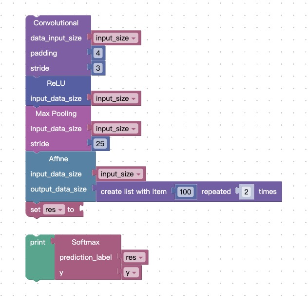
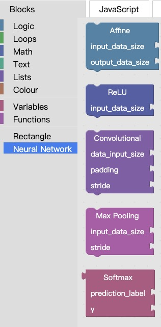
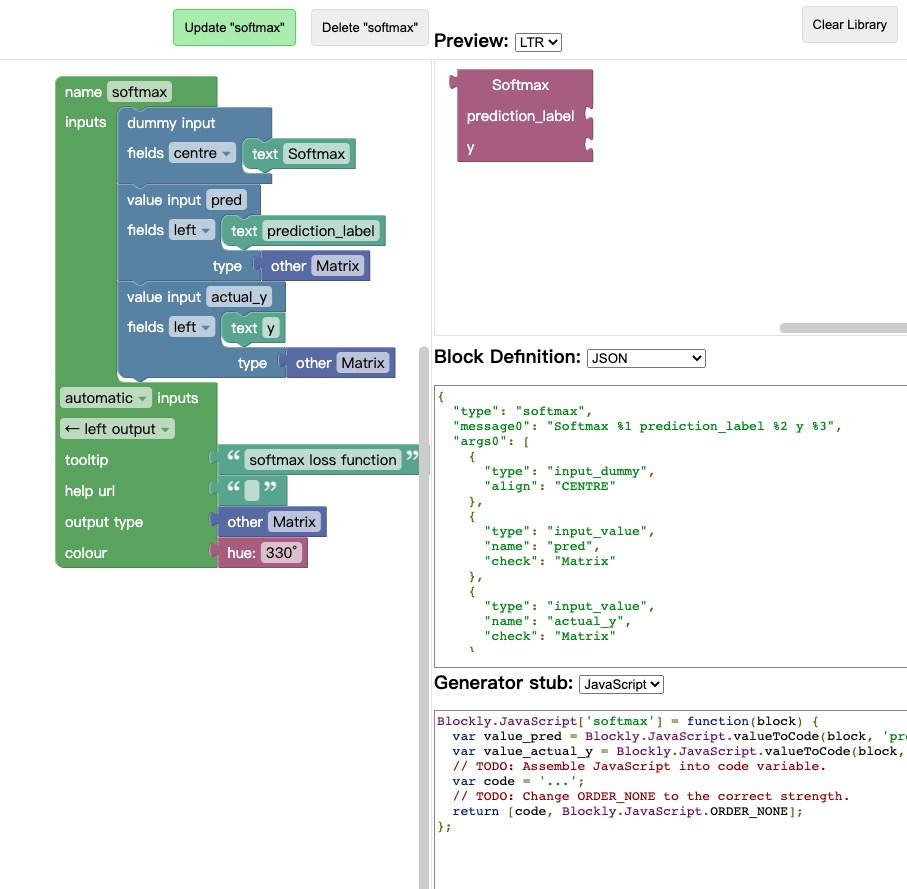
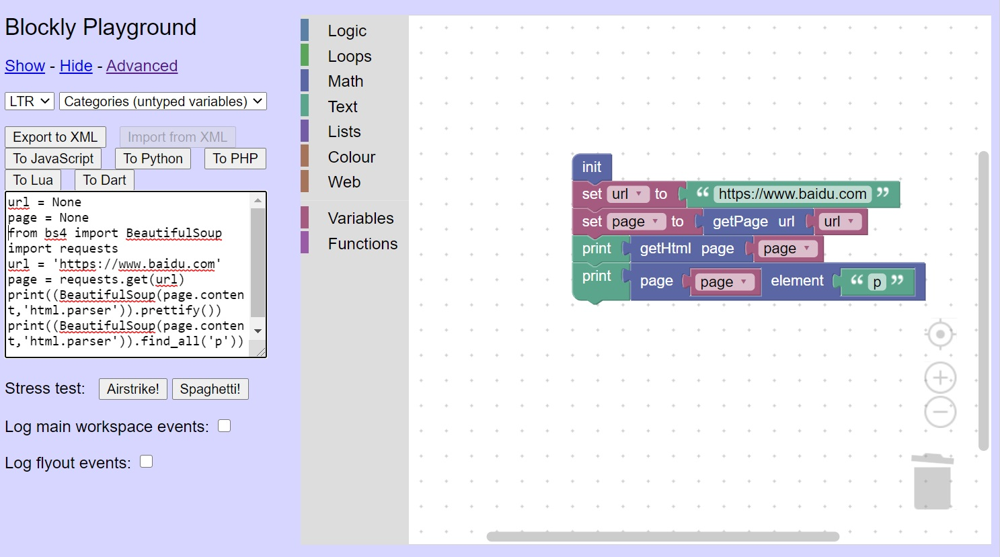
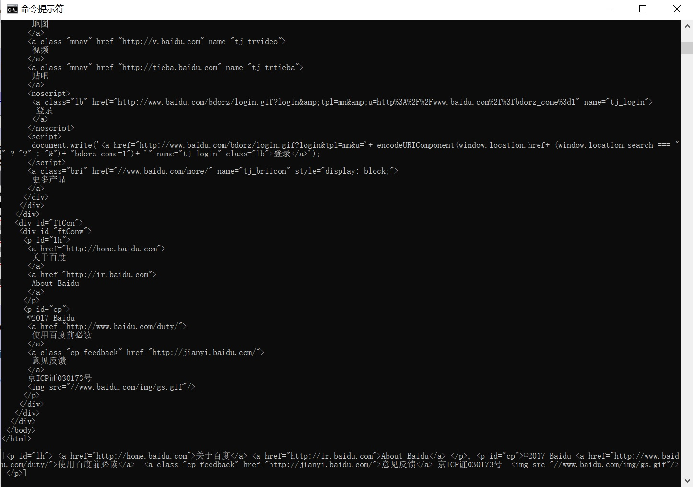

# 报告和答辩

[TOC]


## 前期的资料调研：Blockly和相关的平台 （张丰泽、王中亮）

### Blockly简介 & Blockly特点特性

```
https://developers.google.com/blockly/guides/overview
1. 将页面的重要内容概括和摘要整理到这里
2. 配有相应的图片和解释（block/workspace/js generator等重要元素）
```

### 基于Blockly的平台 

* App Inventor
* Scratch Game
* Blockly Game

```
查看相应的网站
每个平台的内容应该包含以下部分
1. 平台的简单介绍 （是什么，提供了什么新的功能）
2. 平台和Blockly之间的关系（如何基于Blockly，和Blockly有什么不同）
```

### 相关的论文

```
三篇论文
概括每篇论文讲了什么（从摘要里面概括即可）
```


## 从Blockly拓展到Blockly2Java（宋子阳）

### 渴望解决的问题

从上述的分析中我们发现，Blockly虽然有着轻量级、可定制等诸多优点，但是其实际应用范围和应用领域非常狭窄。在第一部分文献调研中，基于Blockly的三个平台APP Inventor/Blockly Games/Scratch都是偏向于编程教育的平台，目标群体用户是编程领域的初学者或者是少儿编程的参加者。例如Scratch和Blockly Games更多被用在少儿编程培训上，而APP Inventor面向的更多是非专业的安卓程序开发者，或者说是手机编程开发初学者。真正实际的安卓程序开发肯定是用专业的Java/Kotlin。

总的来说，Blockly平台较难被用在实际的生产开发中来，解决现实中的实际问题。这样的发现驱动着我们进行本项目Blockly2Java的研究。我们最初是希望能够保留Blockly的轻量级、可视化积木编程的搭建和易于使用的特性，进一步拓展其表达能力和解决问题的能力，使得使用者能够真正的用这个平台解决生产生活中遇到的问题。

在具体的实现层面上，由于Blockly只支持简单的脚本语言，因此要实现在生产生活中的运用，首当其冲的就是要扩展Blockly支持的语言，使得其支持实际的生产语言。因此我们选择了Java语言作为我们的基础语言，打算将Blockly扩展支持Java语言的读写和转换，从而将Java语言的灵活性、通用性和强大的语言表现能力迁移到Blockly平台上来。

此外，我们希望进一步拓展这个平台，通过模块组织和层级分化的方式，从高到低提升Blockly的表现能力。在低的层面上，能够支持用户直接修改Block背后的代码，通过给最原生的Access来获得最灵活的定制能力。在高的层面上，能够支持用户通过拖拽和组合Block来模块化定制功能，从而实现强封装和易于使用的功能。

```
1. Blockly的应用领域比较狭窄：教育领域
2. 希望拓展Blockly到具有生产能力和解决问题能力的场景中来
3. 拓展到Java语言（支持强类型语言，OOP和现有的库函数）
4. 平台化和易扩展的的定制化
```


## 项目的分析和总体介绍（宋子阳，俞哲轩）

### 使用场景

在许多任务驱动型的项目中，往往会要求工作人员进行一定量的技术性工作，以完成某些目标。但是这些技术性的工作，往往都是功能性的、且对于非专业人士来说，具有一定的上手难度——譬如编写一个网页爬虫脚本、搭建一个轻量级神经网络、制作一个简易的网页小游戏等。

我们期望将这些技术性工作“抽象化”、“模块化”、“Blockly化”，将程序复杂的代码实现，浓缩于一个个小巧精美的blockly积木中，允许我们的用户在没有太多编程基础的前提下，只要对于自己的任务有清晰的认识，即可用积木“搭建”出他需要的程序，并且成功运行、取得他所希望的结果。

让我们亲自来搭建一个**卷积神经网络**，看看用代码一步步实现对比用积木一块块搭建的区别：

对于一个标准化的CNN，通常需要`“Convolution - ReLU - Pooling - Affine - ReLU - Affine - Softmax”`一共七层，为了描述的简单化，我们采用如下五层结构`“Convolution - ReLU - Pooling - Affine - Softmax”`来构建我们的`“SimpleConvNet”`

如果用Python代码构建框架，其大致结构如下：

```python
class SimpleConvNet:
    def __init__(self, input_dim=(1, 28, 28),
                 conv_param={'filter_num':30, 'filter_size':5,
                             'pad':0, 'stride':1},
                 hidden_size=100, output_size=10, weight_init_std=0.01):
      
        # get initial parameter from conv_param
        filter_num = conv_param['filter_num']
        filter_size = conv_param['filter_size']
        filter_pad = conv_param['pad']
        filter_stride = conv_param['stride']
        input_size = input_dim[1]
        conv_output_size = (input_size - filter_size + 2*filter_pad) / \
                            filter_stride + 1
        pool_output_size = int(filter_num * (conv_output_size/2) *
                               (conv_output_size/2))
        
        # initialize weights and biases
        self.params = {}
				self.params['W1'] = weight_init_std * \
                    np.random.randn(filter_num, input_dim[0],
                                    filter_size, filter_size)
				self.params['b1'] = np.zeros(filter_num)
				self.params['W2'] = weight_init_std * \
                    np.random.randn(pool_output_size,
                                    hidden_size)
				self.params['b2'] = np.zeros(hidden_size)
        
        # build layers of the neural network
        self.layers = OrderedDict()
				self.layers['Conv1'] = Convolution(self.params['W1'],
                                   self.params['b1'],
                                   conv_param['stride'],
                                   conv_param['pad'])

				self.layers['Relu1'] = Relu()
				self.layers['Pool1'] = Pooling(pool_h=2, pool_w=2, stride=2)
				self.layers['Affine1'] = Affine(self.params['W2'],
                              self.params['b2'])
				self.last_layer = softmaxwithloss()
```

而如果我们采用Blockly搭建我们的神经网络，其大致结构如下：



也就是说，只需要我们的使用者，清楚一个卷积神经网络需要哪些层来构成，然后依次拖动我们的积木块拼接起来，输入各种块预先定义好，由使用者自行设定的参数（例如`input size`、`padding`、`stride`等），就可以成功搭建一个神经网络——而且，“Blockly神经网络“也足够强大，能够完成大部分“代码神经网络”需要完成的任务，因为，每一块Blockly的背后也是代码。

我们会为我们的项目，搭建一个**公共平台（Public Workspace）**，允许使用者自由地使用已经封装好的各种积木，去实现他们所需要完成的任务。我们也会为各种特定任务，建立各类**“Blockly仓库”**，里面**专门**存放完成这项任务，可能会需要的各种积木块。让我们继续以搭建卷积神经网络为例：



我们会在**Workspace**中，专门开辟一个**Neural Network Category**，将所有用来搭建神经网络的块放在其中，如`Affine`、`ReLU`、`Convolutional`、`Max Pooling`、`Softmax`、`Sigmoid`、`Tanh`等——只要你可能会使用到的，我们都会提供。而使用者，只需要拖动积木块，拼接在一起，输入必须的参数，就完成了搭建一个性能优越的神经网络。

### 目标用户

至此，你可能不禁会产生这样的疑问：“那这些预先定义好的积木块是哪里来的呢？难道全部都是我们项目组自行定义的吗？那维护成本不会很高吗？”

我们项目组确实会预先定义一些常用的功能块，但是这显然会被局限在一个较小的范围内，也无法为更多特定功能提供预定义好的积木块。而如果采取不断更新补充的方式的话，又会使工作量大大增加，且效率不高。

因而，我们会提供一个**公共开发平台（Public Block Factory）**，允许既熟悉代码语法，又对Blockly开发有简单了解、或是乐意花简短的时间做了解的开发者，设计并上传自己定义的积木块。在我们项目组进行测试和审核之后，会加入相关任务的**Category**或者新建全新的**Category**用于添加这些新加入的积木块进入**Public Workspace**。

#### 开发者

开发者该如何自定义一个代码块呢？让我们以卷积神经网络中的**Softmax Layer**为例：



1. 开发者先用程序语言定义底层的代码和结构（目前支持`Java`），包括类的字段、构造方法以及其它方法；
2. 构建完以`Java`为基础的代码之后，通过**配置文件**转化成Blockly积木块
3. 我们把***Java Code***转化为***Json***对象，通过***Json***对象再重构出***Blockly***

（实现细节请参见：下一部分—一个Java转Block的代码示例）

#### 使用者

对于使用者来说，使用Blockly积木块开发应用程序非常简单，只需要在我们提供的**公共平台（Public Workspace）**上找到自己任务相关的积木块，根据程序逻辑逐块搭建，输入要求的相关参数，即可实现相应的应用程序。

构建完成的**组合Blockly**本身，即是一个可运行程序，可以完成相关任务；同时，我们也会提供**组合Blockly**对应的程序代码，使用者将代码转移至与程序语言对应的文件中，亦可以运行程序，完成相关任务。

## 项目的实现和进展

###垂直领域的定义：爬虫

我们利用已有的Blockly的平台内容，搭建了一个简单的基于python的爬虫模块。

我们实现了以下的函数并且创建了相应的block:

*getPage(url):向url发送请求，获取页面和相应
*getHtml(page):解析获取page的html
*getElement(page,elementName):获取page html中的所有elementName元素，作为列表返回。

```javascript
Blockly.Blocks['web_init'] = {
    init: function() {
        this.appendDummyInput()
            .appendField("init");
        this.setNextStatement(true, null);
        this.setColour(230);
        this.setTooltip("");
        this.setHelpUrl("");
    }
};
Blockly.Blocks['web_getPage'] = {
    init: function() {
        this.appendValueInput("url")
            .setCheck("String")
            .appendField("getPage")
            .appendField("url");
        this.setOutput(true, null);
        this.setColour(230);
        this.setTooltip("");
        this.setHelpUrl("");
    }
};
Blockly.Blocks['web_getHtml'] = {
    init: function() {
        this.appendValueInput("page")
            .appendField("getHtml")
            .appendField("page");
        this.setOutput(true, null);
        this.setColour(230);
        this.setTooltip("");
        this.setHelpUrl("");
    }
};
Blockly.Blocks['web_getElement'] = {
    init: function() {
        this.appendValueInput("page")
            .setCheck(null)
            .appendField("page");
        this.appendValueInput("element")
            .setCheck(null)
            .appendField("element");
        this.setInputsInline(true);
        this.setOutput(true, null);
        this.setColour(230);
        this.setTooltip("");
        this.setHelpUrl("");
    }
};
```

下面是本例的一个简单应用



运行生成的代码，能够成功读取网页信息



###一个简单的XML2Java的demo （潘星宇、俞哲轩）

实现的功能描述XML 2 JAVA子集的一个，目的是为了XXX。这个子集包括了XXX

具体的实现架构：

Input/Output

代码的组织架构（interface是怎么样的）

最后再来一些实现细节（Math

###一个Java转Block的代码示例 （宋子阳）


我们实现了一个java Class向一个Blockly WorkSpace互转的功能。


在Java中，一个简单的Class Definition可能包含以下的部分

* Class Definition
  * Static Methods
  * Static Fields
  * Constructor
* Class Instance
  * Member Functions
  * Private Fields
  * Public Fields

我们的通过设计，进行了如下对应


####（一）实现Java Method和Blockly Block的一一对应

首先，我们将Method（Java）和Block（Blockly）作了一一映射。

在Java中，一个Method由以下三部分组成。

1. 方法签名 (signature) （包括方法的名称和方法的参数类型列表）
2. 返回类型 （方法返回的参数类型）
3. 方法主体 （方法的主代码块）

在Blockly中，一个Block由以下的部分组成

1. Block Type （Block的类型）
2. Block Message （描述Block的功能，也可以看作Block的Name）
3. args （Block在建立的时候所需要的参数，包含参数类型和参数名称）
4. Output（Block输出的类型）
5. 其他辅助功能（Tips/ manual）


因此， Java的Method和Blockly的Block有天然的对应关系。我们将使用以下的对应关系。

| Java                 | Blockly           |
| -------------------- | ----------------- |
| Method Name          | Block Message     |
| Method Return Type   | Block Output Type |
| Method Argument List | Block args        |
| Method Body          | 新增Code Body     |

在实现上，我们通过实现了Java Annotaion Blockly对Java的Method进行标注。Annotation如下

```java
public @interface Blockly {
    String returnType() default "";
    String methodName() default "";
    String methodBody() default "";
    String[] argType();
}
```

对应的Method标注例子如下

```java
@Blockly(returnType = "Integer", methodName = "calcArea@I_String", argType = {"Integer", "String"})
public int calcArea(int deprecatedI, String deprecatedS){
  return this.width * this.height;
}
```

之后，再通过Java Annotaion提供的反射机制和Java Back Engine的preprocessor程序，将每一个Annotated的Method转成一个Block的定义文件JSON

**注意** 由于Blockly中并没有类方法和的概念，所有的Block都可以被看作是global的一个Method，因此我们默认Block的第一个参数默认传入的是Class Instance。在这一点上，这和Python的self参数非常相似。一个Method的Block定义如下

```javascript
Blockly.defineBlocksWithJsonArray([{
  "type": "getArea",
  "message0": "get area of %1",
  "args0": [
    {
      "type": "input_value",
      "name": "rectangle_instance",  //注意到，第一个参数是rectangle_instance, 也就是self
      "check": ["Variable", "rectangle_instance"],
    },
    {... //Other Arguments}
  ],
  "output": "Number"
}])
```


#### （二）在Method和Block对应的基础上，实现Java Field和Block的对应

Java Field主要包含两种变量，一种是Private变量，一种是Public的变量。经过讨论分析，我们认为private的变量是 ***开发者*** 在定制工具箱的过程中会使用到的内部变量，通过Private的方式进行模块化隐藏内部实现，因此没有必要在前端Block中进行展示和使用。因此，对于Private变量，后端的Java Engine会直接在生成Block过程中忽略。对于Public的变量，由于Block中没有类变量这样的概念，因此我们采取这样的对应方式：

对于每一个Public变量，我们自动生成变量的getter和setter的方法，同时改变变量的可见性从Public成为Private。也就是说，对于每一个public变量，我们都生成两个Java Method，对应的功能就是getter和setter。我们将这两个Method方法通过（一）中描述的方式转换成对应的Block。

| Java          | Blockly                       |
| ------------- | ----------------------------- |
| Private Field | (concealed)                   |
| Public Field  | Getter/Setter Method, Ref(一) |

到此为止，我们已经实现了Java Class中Member Method和Field和前端Block对应的关系。


####（三）在Member Method和Field和Block对应的基础上，实现特殊的Class成员对应关系

我们还需要解决的对应是Constructor和Static Methods和Static Fields和Blockly的关系

* Constructor

  我们最终决定将Constructor实现成一个普通的Initialization Member Method。由于Blockly不存在“当一个对象生成的时候进行空间分配并且调用Constructor进行初始化”的相关概念和能力，因此我们决定将采用古老的C Style初始化方式。也就是说，将Constructor映射成以NewInstance开头的一个普通Method成员，并且要求用户在使用Class的时候通过这个方式进行对象的初始化。

* Static Fields

  我们将Static Field实现成一个Global Variable。通过在取名的时候在之前加上类似__${_CLASS_NAME}__的标注符号来指明这个变量是属于这个Class的。这一点上也非常的C Style。但是由于这个过程是我们的Java Engine和前端Parser自动加上和移除前缀的，因此能够保证不出现namespace violation的情况出现。

* Static Methods

  由于Static Methods基本上都会和Static Fields变量进行绑定，因此我们同样采取，将Static Method实现成一个通用的Method，并且将Static Field作为Argument进行传入的方式来对其进行对应。

| Java           | Blockly                               |
| -------------- | ------------------------------------- |
| Constructor    | Positive Called Initialization Method |
| Static Fields  | Global Variable with prefix           |
| Static Methods | Method with Static Fields as Args     |

#### 例子

一个Java Class，为Rectangle类定义如下

```java
/* Class Rectangle包括三个fields, 一个constructor和一个method*/
public class Rectangle {
    public int width;
    public int height;
    public String color;

    @Blockly(returnType = "Integer", methodName = "_rect_calcarea@integer_string", argType = {})
    public int calcArea(){
        return width * height;
    }

    public Rectangle(int width, int height, String color) {
        this.width = width;
        this.height = height;
        this.color = color;
    }
}
```

对应的前端Block（第一个是构造函数，第二个是width的getter，第三个是一个member method）


对应的usage


这一段对应代码

```java
Rectangle rect = new Rectangle(123, 10+23, "red");
System.out.println(rect.getWidth());
System.out.println(rect.getArea());
```

